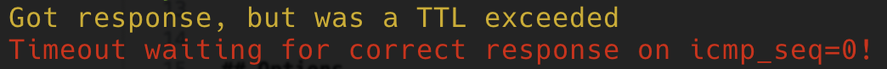

# Cloudflare Internship Application: Systems


## What is it?

This is a small Ping CLI application for MacOS and Linux implemented in Rust. It accepts a hostname or an IP address as its argument, then send ICMP "echo requests" in a loop to the target while receiving "echo reply" messages.

It displays when a ping request, times out:


When the response is from a past ping request (Expired)


When the response is a TTL expired one (but it still waits until timeout for a correct response, just in case)


When the response is correct


Uppon receiving SIGINT (Control + C) displays pings statistics


## Options

It only requires the `--hostname-or-ip` flag, which should be a hostname or ip. 

Example: `sudo cargo run -- --hostname-or-ip 104.17.175.85` or `sudo cargo run -- --hostname-or-ip cloudflare.com`

The optional flags are:
```--time-between-pings``` which specifies the time to wait between a timeout or sucessful response and a new ping request. Defaults to 1000ms.

```--timeout``` sets the maximum amount of time to wait for a ping response. Defaults to 1000ms.

```--ttl``` sets the TTL of ping requests. Defaults to 64.

# Note on IPv6 and extra credit tasks

From the original task:
```
1. Add support for both IPv4 and IPv6
2. Allow to set TTL as an argument and report the corresponding "time exceeded” ICMP messages
3. Any additional features listed in the ping man page or which you think would be valuable
```

The second point was added, but the first one was very difficult since my ISP does not provide IPv6 support as shown by a screenshot from https://ipv6-test.com/, so only IPv4 is supported:


